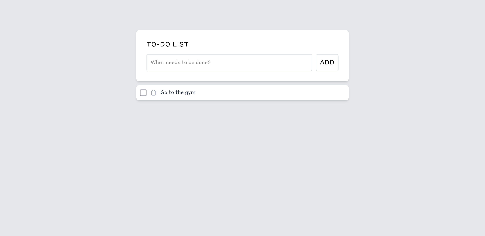

# Next.js Todo App

A simple Todo application built with Next.js and TypeScript that demonstrates API routes, optimistic UI updates, and basic CRUD operations.



Live Site : [Clicke here](https://madhu-to-do-app.vercel.app/)

## Features

- Create new tasks
- Mark tasks as complete/incomplete
- Delete tasks
- Optimistic UI updates for smooth user experience

## Tech Stack

- Next.js 15.3.0
- React 19
- TypeScript
- Tailwind CSS
- Lucide React for icons

## Getting Started

### Prerequisites

- Node.js (LTS version recommended)
- npm or yarn

### Installation

1. Clone the repository:

```
git clone https://github.com/yourusername/nextjs-todo-app.git
cd nextjs-todo-app
```

2. Install dependencies:

```
npm install
# or
yarn install
```

3. Run the development server:

```
npm run dev
# or
yarn dev
```

4. Open [http://localhost:3000](http://localhost:3000) with your browser to see the application.

## Project Structure

- `app/page.tsx` - Main Todo application component with state management
- `app/lib/data.ts` - In-memory data store and CRUD functions
- `app/api/todos/route.ts` - API routes for listing and creating todos
- `app/api/todos/[id]/route.ts` - API routes for updating and deleting specific todos

## Next Steps

- Add persistent storage with a database
- Add authentication
- Implement filtering and sorting
- Add due dates to tasks

## License

MIT
